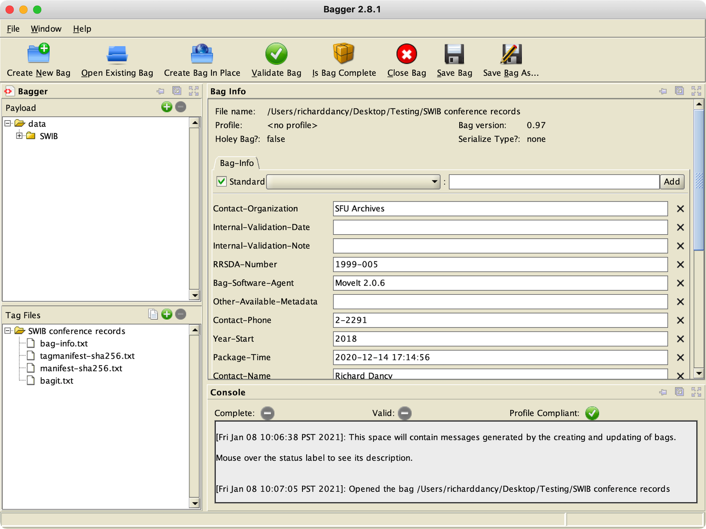

###### [Digital Repository Utilities](../README.md)

# Bagger

Bagger is open-source, java-based desktop application for creating, editing, and validating Bags – i.e. packages of data files that adhere to the [BagIt specification](https://tools.ietf.org/html/rfc8493). Bagger was developed and is maintained by the Library of Congress. The latest version ([2.8.1](https://github.com/LibraryOfCongress/bagger/releases/tag/v2.8.1)) was released in April 2018.

SFU Archives uses Bagger in its digital transfer workflow to validate transfer packages received and add validation metadata.

Note that the Archives has its own preferred Bag-creating packager ([SFU MoveIt](sfu-moveit.md)) and uses Bagger only for validation purposes. The Archives has begun work on another app ([SFU ProveIt](sfu-proveit.md)) that may eventually take over these validation functions.

There are a number of motivations for developing SFU-specific alternatives to Bagger. Bagger is designed to be a generic tool that can be used by any institution. SFU-themed apps, on the other hand, can focus the interface specifically on the requirements of the Archives' own workflows. Field labels exposed to end users are based on BagIt requirements, but do not require users to understand the BagIt spec and its terminology.

It is not clear, morever, whether Bagger is still actively maintained. The current release validates Bags against BagIt version 0.97 rather than 1.0 (finalized in Oct 2018). Bagger will fail packages that use "1.0" as the `BagIt-Version` in the `bagit.txt` file. For this reason, SFU MoveIt continues to use "0.97" as the version value, even though it fully complies with BagIt 1.0.

**Contents**
- [Installation](#installation)
- [Configuration](#configuration)
- [Usage](#usage)
- [Links](#links)

## Installation
Download the latest release from the [Bagger GitHub page](https://github.com/LibraryOfCongress/bagger/releases/tag/v2.8.1) and unzip the file. This will create a `bagger-2.8.1` folder with a number of sub-directories.
- Always keep the sub-directories together with the parent folder.
- The application itself is located at `/bin/bagger`.

You can move the `bagger-2.8.1` folder to and run Bagger from any location on your local machine.
- For consistency, Archives staff should store Bagger in their `Applications` folder.

**Dependencies:**
You will need to have a `Java Runtime Environment` installed in order to run Bagger.
- If a JRE is not yet installed, the first time you try to run Bagger you will get an error message "Unable to locate a Java Runtime".
- To install, go to the [Java website](https://java.com/en/download/) to download.

## Configuration
There are no special configuration requirements. It is possible with Bagger to create and load customized metadata templates ("profiles"), but the Archives does not currently use this feature.

## Usage
To launch Bagger, double-click the `bagger` file in the `bagger-2.8.1/bin` folder; this will launch the GUI.
- Note that this will also typically open a Terminal window and that Terminal may report a warning that "An illegal reflective access operation has occurred".
- This warning can be disregarded, but it is another reason for wishing to move away from use of Bagger.

In the Archives' workflow, an archivist uses Bagger both to validate a transfer package and to add validation metadata to the package when validation is successful (i.e. the Archives accepts the transfer for ingest).

To validate a Bag:
- Click the `Open Existing Bag` button and navigate to the transfer package.
- Click the `Is Bag Complete` button to verify that the package adheres to the BagIt structure.
- Click the `Validate Bag` button to verify the checksums of the files in the package.
- For both tests, Bagger will show results (success / fail) in a pop-up dialog box.
- The results are also displayed in the `Console` panel with a green checkmark against `Complete` and `Valid`.

To add validation metadata:
- Click the `Save Bag As` button.
- In the dialog box, use the `Browse` button to specify the new Bag's location and name.
- Typically do not serialize the Bag (i.e. save a zip file).
- The Archives has no use case for creating a "holey bag".
- Typically use SH256 for the manifest algorithms.

For more detail about these workflows, see the Archives' [digital transfer validation procedures elsewhere on this GitHub site](https://github.com/SFU-Archives/digital-transfer/blob/master/procedures/standard-archives/03-validation.md).

## Links
- [Bagger GitHub page](https://github.com/LibraryOfCongress/bagger).
- [SFU Archives](https://github.com/SFU-Archives) > [Digital Transfer](https://github.com/SFU-Archives/digital-transfer) > [Procedures for Archives](https://github.com/SFU-Archives/digital-transfer/blob/master/procedures/standard-archives/00-introduction.md) > [Validation](https://github.com/SFU-Archives/digital-transfer/blob/master/procedures/standard-archives/03-validation.md)

###### Last updated: Nov 23, 2021
