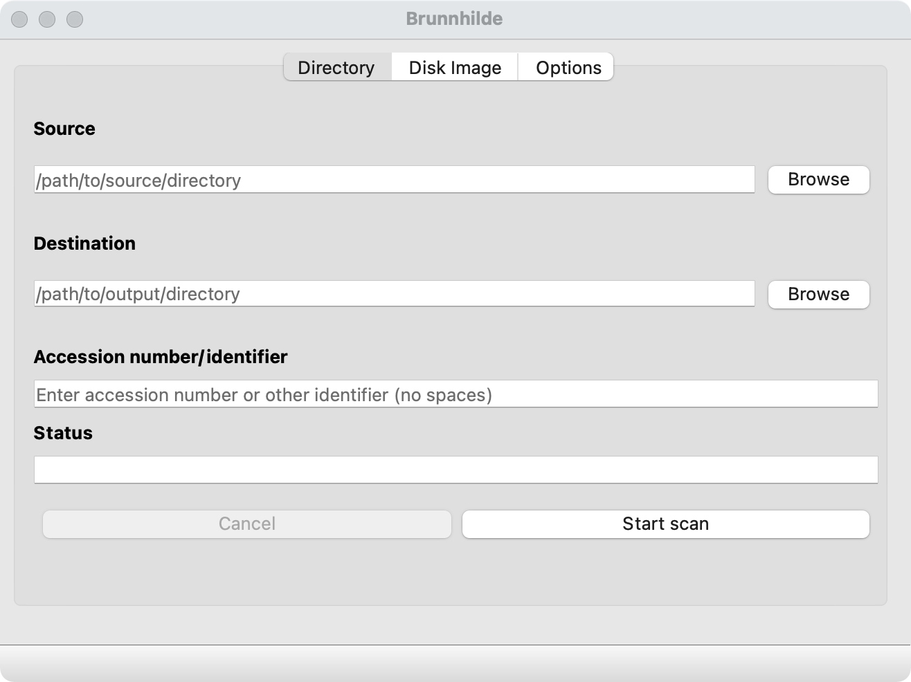

###### [Digital Repository Utilities](../README.md)

# Brunnhilde

Brunnhilde is an open-source utility for analysis and file characterization of disk images and file directories. The app was developed and is maintained by [Tessa Walsh](https://github.com/tw4l).

SFU Archives uses Brunnhilde in its digital transfer workflow to analyze transfer packages prior to ingest and to generate data that supports validation, accessioning, and later appraisal and description. The archivist imports the csv data created by Brunnhilde into the **Validator module** of its AIS database (a custom FileMaker database) to facilitate viewing, searching, and reporting on the data.

**Contents**
- [Installation](#installation)
- [Configuration](#configuration)
- [Usage](#usage)
- [Links](#links)

## Installation
SFU Archives uses the GUI version of Brunnhilde. See the installation instructions on Walsh's GitHub repo for [brunnhilde-gui](https://github.com/tw4l/brunnhilde-gui). Note that various dependencies may also need to be installed.

Archives' staff on SFU managed Macs do not have administrator access to their work computers and will need to put in a ticket with ITS to have Brunnhilde and its dependencies installed.

## Configuration
There are no special configuration requirements.

## Usage
Brunnhilde provides a user interface, but must be launched from the command line in Terminal.
- Navigate to the installation folder and run `$ python3 main.py`.
- You can also just drag the `main.py` file into a Terminal window after entering `$ python3 `.

The Archives' digital transfer procedures typically work with file directories rather than disk images.

On the Brunnhilde interface `Options` tab, initialize the following settings **before** processing the transfer.
- **Uncheck** the boxes under `Virus scanning`; the archivist should run ClamAV independently as part of the transfer workflow.
- Select "sha256" under `Checksum algorithm`.
- Leave **unchecked** the boxes under `Disk image options` (unless working with disk images).
- Under `General options`:
  - **Check** the boxes `Scan archive files...` and `Include Siegfried warnings in HTML report`.
  - Leave **unchecked** the boxes `Run bulk_extractor` and `Throttle Siegfried`.

To process a transfer, use the `Directory` tab.
- `Source`: navigate to the transfer folder; it should be unzipped.
- `Destination`: navigate to the output location; this can be anywhere on your computer.
- `Accession number/identifier`: use the following convention: `ACNYYYY-NNN` (e.g. `ACN2020-041`).
- Click the `Start scan` button.
- The `Status` field will show "In progress".

You will receive a desktop notification when Brunnhilde completes processing.
- For large transfers, completion may take some time (e.g. several hours).

## Links
- Brunnhilde GitHub site: https://github.com/tw4l/brunnhilde.
- Brunnhilde GUI GitHub site: https://github.com/tw4l/brunnhilde-gui.
- SFU Archives digital transfer procedures for archivists: [step 3.4: Analyze files](https://github.com/SFU-Archives/digital-transfer/blob/master/procedures/standard-archives/03-validation.md#34-analyze-files).

###### Last updated: May  6, 2021
