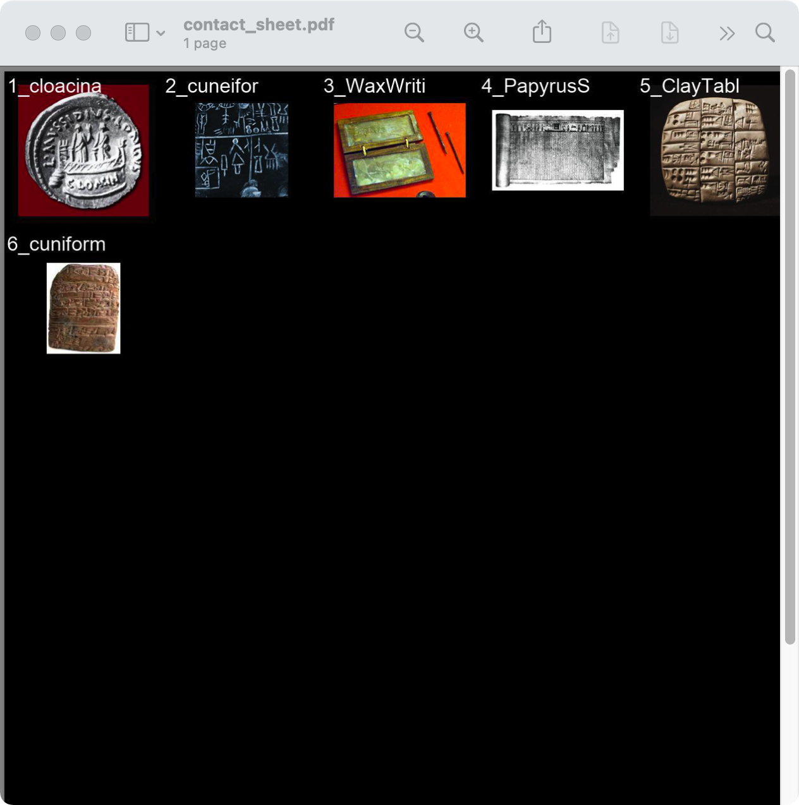
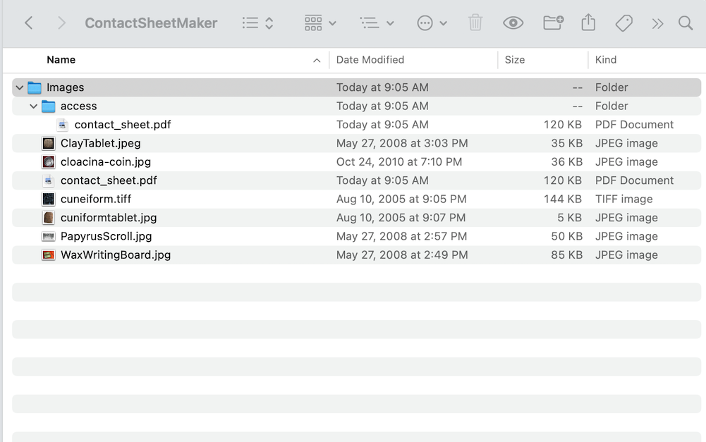

###### [Digital Repository Utilities](../README.md)

# Contact Sheet Maker


ContactSheetMaker is a command-line Python script developed by Kelsey Poloney (SFU Library). It takes a folder of images (typically digital photographs) and creates a set of thumbnail images (one for each file) as a multi-page pdf document. It then structures the parent folder so that it is ready for ingest to Archivematica.

The resulting pdf mimics the analog contact sheet, a positive print of all the negatives from a roll of film to facilitate scanning and selection of images. SFU Archives uses ContactSheetMaker when it receives transfers of folders that contain large numbers of photographs. Rather than uploading each photograph to [SFU AtoM](https://atom.archives.sfu.ca), the processing archivist uses the script to create a digital contact sheet and uploads that instead. Researchers can easily browse the pdf sheet and identify any images for which they would like copies. An archivist can then deliver the copies of the originals offline.

The script can be used in many circumstance, but was originally designed with a particular use case in mind: transfers of photos from campus units that include staff photographers (e.g. University Communications).  These staff typically organize their files into folders representing photo shoots or projects. The folders often contain a very large number of very similar shots, only one or two of which may have been selected for publication / use. Typically the creators do not exercise any further appraisal (i.e. they do not destroy the non-selected images), they often do not document which files were selected, and it is not often possible to determine this years later. The Archives typically does not consider it feasible or desirable to do item-level appraisal and selection, but neither do we wish to flood [SFU AtoM](https://atom.archives.sfu.ca) with a plethora of similar files. By uploading the contact sheet only, we provide simple access to all images, while allowing researchers to identify those for which they wish to get full copies.

## Contents
- [Download](#download)
- [Configuration](#configuration)
- [Usage](#usage)
- [Links](#links)

## Download
Download the Python script as a [zip file here](../downloads/contact-sheet-maker.zip) or from [Kelsey Poloney's GitHub site](https://github.com/kpoloney/contact_sheet).

Unzip and move the `contact_sheet.py` file to wherever you wish to store it.

**Notes**
- The script can be stored and run from any location on your computer.

## Configuration
The script looks for certain file extensions and ignores the rest. You can expand the list of extension by editing `line 17` on the script. Default extensions are:

```
png, jpg, jpeg, tiff, gif, jp2, jpm, jpx, bmd, pct, psd, tga
```

## Usage


Run the script by command line. You'll need to know the full file paths for the location of the script and the target folder containing the photos to be processed.

```
$ python3 /path/to/contact_sheet.py
```

You will be prompted to enter the target folder path.

```
Enter folder location: /path/to/target/folder/
```

The script:
- Creates a new sub-folder called `access`.
- Generates two copies of a pdf file called `contact-sheet.pdf`.
- Places one copy of the pdf file in the `access` folder and one in the top-level directory.

**Notes**
- You can get the file paths of the script and the target folder by dragging them into the Terminal window.

- Make sure to include the closing forward slash `/` on the target folder location.

- The folder structure is ready for ingest to Archivematica: the existence of the `access` sub-folder tells Archivematica **not** to make access copies of the original images and to use the pdf file as the DIP sent to AtoM.

- The script can be run on heterogeneous folders that contains files that are not images; non-image file extensions will be ignored.

- The script is **not** recursive: the target folder **cannot contain sub-folders**.

## Links
- Developer's GitHub site: https://github.com/kpoloney/contact_sheet.

###### Last updated: Jun 4, 2021
