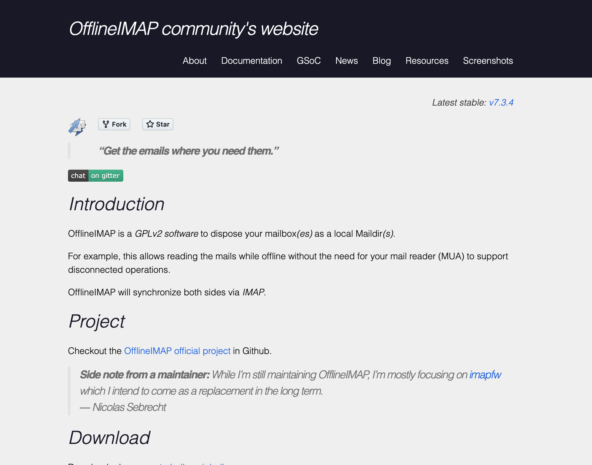

###### [Digital Repository Utilities](../README.md)

# OfflineIMAP


[OfflineIMAP](http://www.offlineimap.org) is an open-source command line utility that export email messages and attachments from an IMAP-based system in [maildir format](https://github.com/SFU-Archives/email-archiving/blob/master/overview/formats.md#maildir).

SFU Archives uses it in the email transfer workflow to export email from SFU Mail, then separately convert the `maildir` output into [mbox format](https://github.com/SFU-Archives/email-archiving/blob/master/overview/formats.md#mbox) for ingest to ePADD (archival processing) and Archivematica (long-term preservation).

## Contents
- [Install](#install)
- [Configuration](#configuration)
- [Usage](#usage)
- [Links](#links)

## Install
Install **OfflineIMAP** with [Homebrew](homebrew.md).
- `$ brew install offline-imap`

## Configuration
The configuration file must be edited before running the program. On Macs, the config file is a hidden file located in your `Home` director.
- `~/.offlineimaprc`.
- You can view Mac hidden files by pressing `SHIFT` + `COMMAND` + `.`
- Edit the config file with a text editor, e.g. BBEdit.

```
[general]
metadata = ~/offlineimap/metadata
accounts = SFU

[Account SFU]
localrepository = LocalMaildir
remoterepository = RemoteSFUIMAP

[Repository LocalMaildir]
type = Maildir
localfolders = <<path/to/maildir/output/folder/>>
sep = /

[Repository RemoteSFUIMAP]
type = IMAP
remotehost = <<mail-server-address>>
remoteuser = <<transfer-account-name>>
remotepass = <<*******>>
folderfilter = lambda folder: folder in ['folder1', 'folder1/folder2']
readonly = yes
sslcacertfile = /usr/local/etc/openssl/cert.pem
```

Key variables:
- `localfolders` = the location of the output folder for exported email.
- `remotehost` = name of the active email server.
- `remoteuser` = user name of target email account.
- `remotepass` = account password; you can delete this line and be prompted for the password when running the script.
- `folderfilter` = list of specific folders to target; delete this line if transferring the entire account; if using, you need to explicitly list all sub-folders.

## Usage
Once you have edited the config file, open a Terminal window to run the script.
- `$ offlineimap`

## Links
- [OfflineIMAP project site](http://www.offlineimap.org)
- [SFU Archives email transfer procedures](https://github.com/SFU-Archives/email-archiving/blob/master/archivists/overview.md)

###### Last updated: Jul 26, 2022
